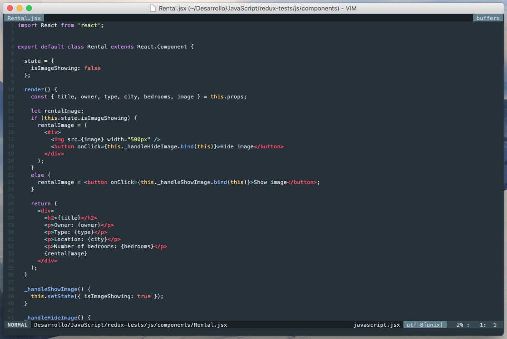
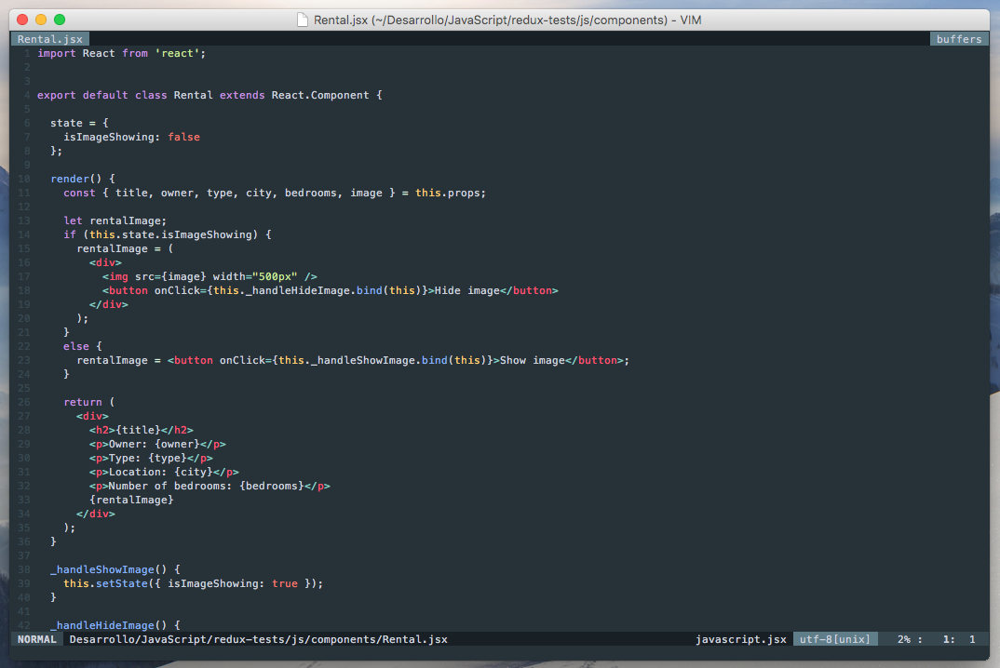

# Vim XML Syntax

Tweaked Vim XML syntax to make it look more similar to html syntax plugin. Mainly used in React development.
It's a 95% equal to the original vim-xml syntax plugin.

## Screenshots

Notice the end tags.

### Before

### After

